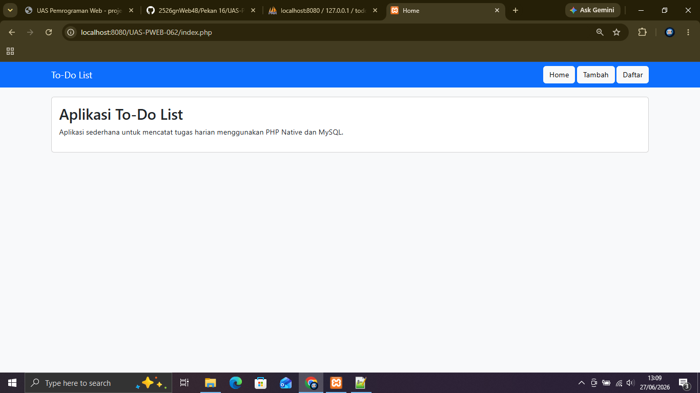
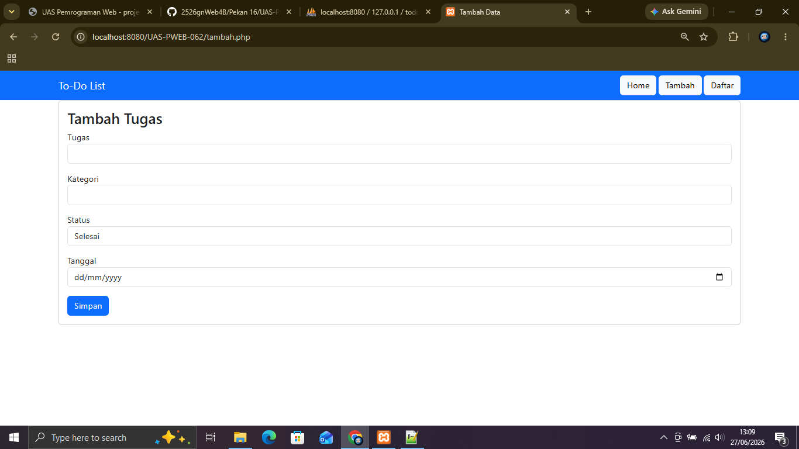
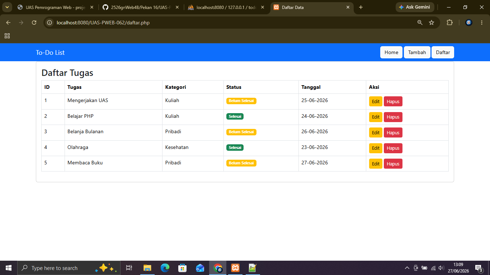
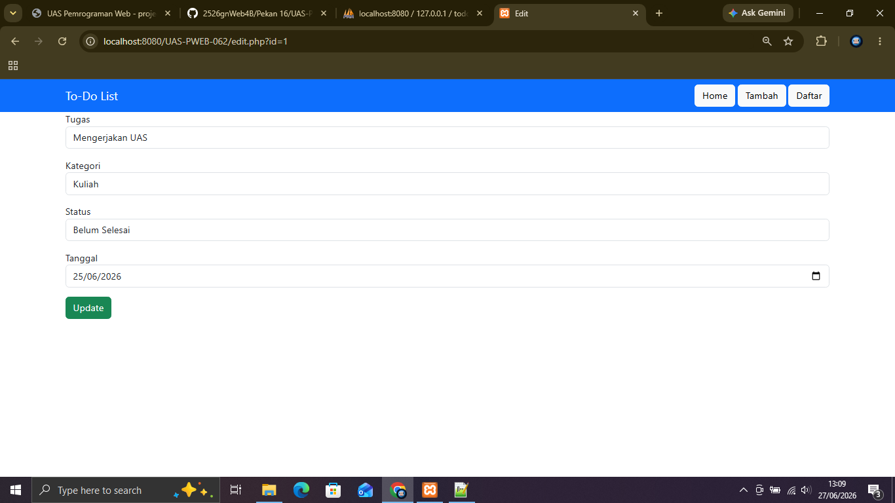

# Aplikasi To-Do List Sederhana

## Nama
Rahman Dwi Irfiyanto

## NIM
240631100062

## Judul Aplikasi
Aplikasi To-Do List Sederhana Berbasis Web

## Deskripsi Singkat
Aplikasi To-Do List merupakan aplikasi berbasis web yang digunakan untuk mencatat dan mengelola daftar tugas. Pengguna dapat menambahkan, melihat, mengubah, dan menghapus data tugas. Aplikasi ini dibuat menggunakan HTML, CSS, Bootstrap, PHP Native, dan MySQL.

## Screenshot Aplikasi

### Halaman Home



### Halaman Tambah Data



### Halaman Daftar Data



### Halaman Edit Data



## Struktur Database

**Database :** `todo_db`

**Tabel :** `todo`

| Field | Tipe |
|-------|------|
| id | INT (Primary Key, Auto Increment) |
| tugas | VARCHAR(255) |
| kategori | VARCHAR(100) |
| status | VARCHAR(50) |
| tanggal | DATE |

## Cara Menjalankan Aplikasi

1. Install XAMPP.
2. Jalankan Apache dan MySQL.
3. Salin folder project ke dalam folder `htdocs`.
4. Buka phpMyAdmin.
5. Import file `database.sql`.
6. Buka browser.
7. Akses alamat:

```
http://localhost/UAS-PWEB-2526G-240631100062/
```

## Teknologi yang Digunakan

- HTML5
- CSS3
- Bootstrap 5
- PHP Native
- MySQL
